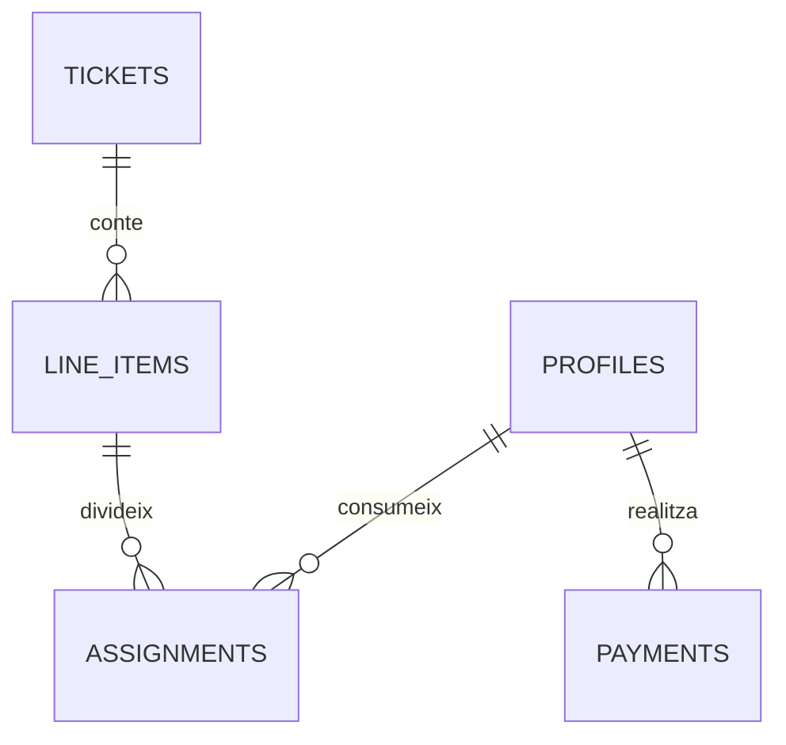

# Acces a Dades  i Digitalització — PagoLoMio

> PagoLoMio és un cas d'èxit en la transformació digital del sector HORECA, convertint un procés tradicionalment analògic i ineficient (el tiquet en paper) en un flux de dades estructurades, segures i sincronitzades en temps real mitjançant tecnologies Cloud i Intel·ligència Artificial.

## Arquitectura de dades
El nucli del sistema es basa en un esquema relacional a PostgreSQL (Supabase) optimitzat per a la consistència de dades. La digitalització comença en el moment que el tiquet físic és processat pel pipeline de dades:

1. **Captura analògica**: Foto del tiquet en paper.
2. **OCR Local (ML Kit)**: Extracció geomètrica del text per a garantir la privacitat i estalvi de dades.
3. **Refinament LLM (Groq/Gemini)**: Conversió de text no estructurat en JSON validat.
4. **Persistència relacional**: Emmagatzematge en taules normalitzades (`tickets`, `line_items`, `assignments`).



## Seguretat i control d'accés
La digitalització exigeix una seguretat superior a la del món analògic. Mentre que un tiquet en paper es pot perdre o ser llegit per qualsevol, PagoLoMio implementa **RLS (Row Level Security)** per a garantir que les dades només siguen accessibles pels membres del grup.

```sql
-- Política RLS: Cap usuari pot veure el tiquet d'un grup on no està
CREATE POLICY "Acces segur per grup"
  ON public.tickets
  FOR SELECT
  USING (
    EXISTS (
      SELECT 1 FROM public.group_members
      WHERE group_members.group_id = tickets.group_id
        AND group_members.user_id = auth.uid()
    )
  );
```

## Sincronització i temps real
La transformació digital permet que la liquidació siga col·laborativa. Mitjançant **Supabase Realtime**, cada vegada que un usuari "digitalitza" la seua part del sopar (reclamant un producte), la resta del grup ho veu a l'instant, evitant duplicitats que el mètode analògic no pot controlar.

```dart
// lib/presentation/providers/providers.dart
channel.onPostgresChanges(
  event: PostgresChangeEvent.insert,
  table: 'assignments',
  callback: (_) => reloadTicket(),
).subscribe();
```

## El procés de digitalització del tiquet
PagoLoMio aplica un concepte de **"Paperless by Design"**. El tiquet en paper desapareix en segons per a convertir-se en un actiu digital traçable:
- **Flux complet**: Paper → OCR local (Dart) → LLM al núvol (JSON) → DB Estructurada → Interfície reactiva.
- **Seguretat analògica vs digital**: Un tiquet en paper és fràgil i efímer. En digitalitzar-lo a Supabase, la informació és resilient, disposa de còpies de seguretat automàtiques i permet una traçabilitat total de qui ha pagat què, actuant com una auditoria comptable digital.

## Impacte i transformació digital en l'hostaleria
La digitalització amb PagoLoMio beneficia directament el xicotet comerç i l'hostaleria local de València:
- **Zero fricció per al restaurant**: El local no ha d'implementar cap software nou ni canviar el seu TPV. PagoLoMio digitalitza l'eixida del procés (el tiquet).
- **Eficiència de sobretaula**: Substitueix el tediós procés de "a veure qui té canvi" o fer càlculs amb la calculadora del mòbil per un algoritme d'optimització de deutes nets.
- **Inclusió tecnològica**: Porta capacitats d'IA i Cloud a entorns tradicionals, millorant l'experiència del client i accelerant la rotació de taules per al restaurador.
