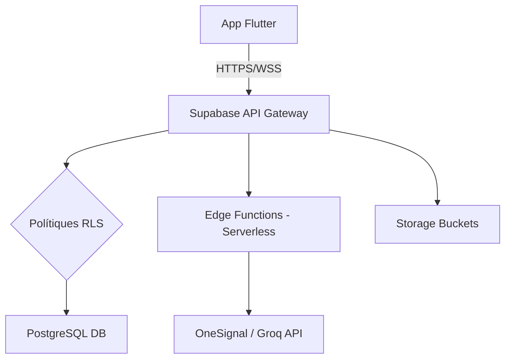

# CLOUD - PagoLoMio

> PagoLoMio utilitza Supabase com a capa d'abstracció d'infraestructura Cloud, aplicant conceptes equivalents als serveis d'AWS per a oferir una plataforma escalable, resilient i altament disponible.

## Secció 1 — Arquitectura Cloud de PagoLoMio
L'arquitectura flueix des del dispositiu mòbil (Edge) fins al backend gestionat, seguint les capes estàndard del Cloud Computing:
- **Compute**: Supabase Edge Functions (Deno/V8) per a processos serverless.
- **Storage**: Supabase Storage (Object Storage) per a fitxers binaris.
- **Network**: API Gateway gestionat per Supabase amb aïllament lògic.
- **Database**: PostgreSQL gestionat (equivalent a Amazon RDS).

## Secció 2 — Emmagatzematge (Equivalent a Amazon S3)
Utilitzem **Supabase Storage** per a l'emmagatzematge d'objectes (imatges de tiquets). 
- **Estructura**: S'organitza en *buckets* privats, seguint el model d'emmagatzematge pla d'objectes.
- **Seguretat**: Igual que les polítiques d'IAM a S3, utilitzem RLS per a permetre la lectura d'imatges només si l'usuari pertany al grup propietari del tiquet, garantint la privacitat del client.

## Secció 3 — Xarxa i seguretat (VPC / NAT Gateway)
Tot i que el projecte és BaaS, l'aïllament és equivalent a una **VPC**:
- **Firewall Lògic**: El RLS actua com un *Security Group* d'AWS. Cap petició pot arribar a la taula `assignments` sense validar la identitat del peticionari.
- **Seguretat NAT**: Les **Edge Functions** actuen com un punt de sortida segur (NAT). El dispositiu mòbil mai parla directament amb APIs externes de tercers (OneSignal); és el servidor qui realitza la cridada externa, protegint les claus d'API.

## Secció 4 — Base de dades gestionada (RDS + Route 53)
El cor del sistema és **PostgreSQL**, l'equivalent a **Amazon RDS**. Aprofitem les capacitats de base de dades gestionada:
- **Triggers i Procediments**: Com `tr_check_assignment_limit`, que automatitza la integritat sense intervenció de l'App.
- **DNS i resolució**: Supabase gestiona la resolució de noms (equivalent a Route 53) mitjançant URLs úniques per a cada projecte (ex: `ref.supabase.co`).
- **Exemple RPC**: La funció `get_frequent_friends()` és un procediment emmagatzemat que s'executa al núvol, reduint la càrrega de processament en el mòbil.

## Secció 5 — Escalabilitat i resiliència
PagoLoMio aplica patrons d'alta disponibilitat propis de sistemes distribuïts:
- **Resiliència de Fallback (Failover)**: El sistema d'IA utilitza un patró de resiliència on, si **Gemini** falla o dóna timeout, el servei commuta automàticament a **Groq (Llama 3)**. Això és l'equivalent Cloud a un *Multi-AZ failover*.
- **Auto-scaling**: Supabase gestiona la càrrega de les Edge Functions, escalant horitzontalment per a absorbir pics de tràfic sense intervenció manual.

## Secció 6 — Cache i temps real (ElastiCache / Redis)
La funcionalitat de **Realtime i Presence** de Supabase s'executa sobre una infraestructura de missatgeria en memòria equivalent a **Amazon ElastiCache**.
- **Cas d'ús**: Sincronització instantània dels avatars dels comensals actius i les porcions reclamades. Es tracta d'un sistema d'estat efímer en memòria que minimitza les escriptures en disc.

