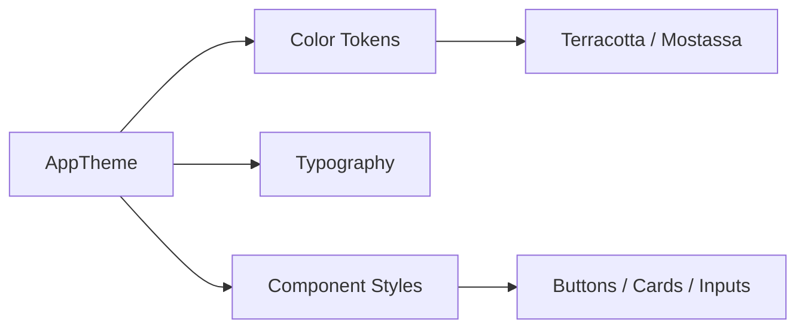

# DI — PagoLoMio

> El disseny de PagoLoMio no és només estètic; és una resposta funcional a l'entorn de baixa lluminositat dels restaurants. Mitjançant el sistema "Essència de Sobretaula", l'aplicació combina calidesa visual amb una jerarquia clara per a reduir la càrrega cognitiva durant el procés de pagament.

## Arquitectura relacionada
El sistema de disseny s'ha implementat de forma centralitzada en Flutter mitjançant el **DDS (Dynamic Design System)**, on tots els tokens (colors, tipografies i espaiats) estan definits en una única font de veritat per a garantir la consistència en tota l'aplicació.



## Implementació tècnica destacada

### 1. Sistema de Colors: "Essència de Sobretaula"
La paleta de colors s'ha seleccionat estratègicament per a entorns de restauració. Utilitzem un fons quasi negre (`bg: 0xFF0D0F14`) per a estalviar bateria (OLED) i evitar el reflex de la pantalla en la taula, amb accents càlids:
- **Terracotta** (`accent3`): Utilitzat per a alertes i accions destructives.
- **Mostassa** (`amber`): Per a avisos i estats que requereixen revisió (com els preus detectats per OCR que són dubtosos).

```dart
// lib/app/theme.dart
static const Color bg = Color(0xFF0D0F14);       // Fonament fosc
static const Color accent3 = Color(0xFFFF6B6B); // Terracotta
static const Color amber = Color(0xFFF59E0B);   // Mostassa
```

### 2. Feedback Visual i Shimmer Effects
Per a millorar la percepció de velocitat, PagoLoMio utilitza **Shimmer Effects** mentre la IA processa el tiquet. Això redueix l'ansietat de l'usuari durant els 2-3 segons d'espera, indicant que el sistema està treballant activament.

```dart
// lib/presentation/screens/ticket/new_ticket_screen.dart
if (isOcrLoading)
  const _OcrLoadingShimmer() // Esquelet animat mentre la IA treballa
else
  RepaintBoundary(child: ListView.builder(...))
```

### 3. Onboarding de 4 Diapositives
L'experiència d'usuari comença amb un recorregut guiat de 4 *slides* que explica el valor de l'app. Aquest component utilitza `PageView` amb animacions d'escala per als icones i indicadors de pàgina animats.

```dart
// lib/presentation/screens/onboarding/onboarding_screen.dart
static const _slides = [
  _OnboardingSlide(icon: Icons.receipt_long, title: 'Benvingut a PagoLoMio'),
  _OnboardingSlide(icon: Icons.document_scanner, title: 'Escaneja el tiquet'),
  _OnboardingSlide(icon: Icons.people, title: 'Reparteix en temps real'),
  _OnboardingSlide(icon: Icons.check_circle, title: 'Menys càlculs, més sopars'),
];
```

## Decisions de disseny i per què
- **Accessibilitat (WCAG)**: S'han utilitzat ràtios de contrast superiors a 4.5:1 per al text primari sobre el fons fosc, garantint la llegibilitat per a persones amb baixa visió.
- **Tipografia Dual**: S'ha triat **Syne** per als títols (personalitat moderna i geomètrica) i **Inter** per al cos de text (màxima llegibilitat en pantalles petites). Per a dades numèriques i preus, s'usa **JetBrains Mono**, una font monoespaiada que facilita la comparació visual de xifres.
- **Empty States**: Cada llista (tiquets, grups) disposa d'un estat buit amb il·lustracions personalitzades per a evitar que l'usuari es trobe davant d'una pantalla blanca sense saber què fer.

## Reptes resolts
Un repte crític va ser la **gestió de la revisió post-OCR**. Com indicar a l'usuari que la IA no n'està 100% segura d'un preu? La solució de disseny va ser aplicar un fons **Mostassa** suau (`amber.withOpacity(0.08)`) a la fila de l'ítem afectat i un icona d'advertència, obligant visualment a la revisió abans de guardar.

## Per aprofundir
1. **Com s'ha adaptat el disseny per a l'ús amb una sola mà (One-Handed Use)?**
   *Resposta:* Els botons d'acció principal (CTA) i la navegació es mantenen en la "zona de polze" (part inferior de la pantalla). Les capçaleres grans en Syne permeten una lectura ràpida mentre el dispositiu es subjecta amb una sola mà.

2. **Per què no s'ha utilitzat un mode clar (Light Mode)?**
   *Resposta:* Atès que l'aplicació està dissenyada per a ser usada en sopars i entorns nocturns, el mode fosc és el defecte per a evitar enlluernar els altres comensals i per a reduir l'impacte visual en l'ambient del restaurant.
