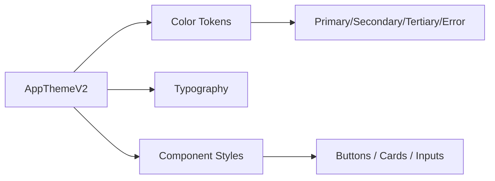

# DI — PagoLoMio

> El disseny de PagoLoMio no és només estètic; és una resposta funcional a l'entorn de baixa lluminositat dels restaurants. Mitjançant el sistema "Essència de Sobretaula", l'aplicació combina calidesa visual amb una jerarquia clara per a reduir la càrrega cognitiva durant el procés de pagament.

## Arquitectura relacionada
El sistema de disseny s'ha centralitzat en Flutter mitjançant el **DDS (Dynamic Design System)** de la versió 2.0 (Tailwind + Material 3 Dark), on els tokens estan definits a [app_theme.dart](file:///c:/Users/User/Desktop/files/PagoLoMio/lib/core/theme/app_theme.dart). Un pont de compatibilitat a [theme.dart](file:///c:/Users/User/Desktop/files/PagoLoMio/lib/app/theme.dart) exposa els colors antics de l'app.


```mermaid
graph LR
    A[AppThemeV2] --> B[Color Tokens]
    A --> C[Typography]
    A --> D[Component Styles]
    B --> E[Primary/Secondary/Tertiary/Error]
    D --> F[Buttons / Cards / Inputs]
```

## Implementació tècnica destacada

### 1. Sistema de Colors: "Essència de Sobretaula"
Utilitzem un fons molt fosc (`0xFF13121B`) per a estalviar bateria (OLED) i evitar el reflex de la pantalla en la taula, amb accents càlids i funcionals:
- **Violeta clar** (`primary` / `accent`): Accent de marca per a accions i botons.
- **Verd menta** (`secondary` / `accent2`): Per a estats de liquidat o correcte.
- **Mostassa** (`tertiary` / `amber`): Per a avisos i ítems post-OCR dubtosos.
- **Terracotta** (`error` / `accent3`): Per a alertes i accions destructives.

```dart
// lib/core/theme/app_theme.dart
static const Color background = Color(0xFF13121B); // Fons fosc
static const Color primary    = Color(0xFFC4C0FF); // Violeta clar
static const Color tertiary   = Color(0xFFFFB785); // Mostassa
static const Color error      = Color(0xFFFFB4AB); // Terracotta
```

### 2. Feedback Visual i Shimmer Effects
Per a reduir l'ansietat de l'espera de 2-3 segons, PagoLoMio utilitza un **Shimmer Effect** animat de fons mentre s'està processant la imatge del tiquet amb IA.

```dart
// lib/presentation/screens/ticket/new_ticket_screen.dart
if (isOcrLoading)
  const _OcrLoadingShimmer() // Esquelet animat mentres la IA treballa
else
  RepaintBoundary(child: ListView.builder(...))
```

### 3. Onboarding de 4 Diapositives
L'experiència comença amb un recorregut dinàmic de 4 *slides* recolzat en un halo de gradient. Els textos i colors són dinàmics per a cada pas adaptats per l'idioma local:

```dart
// lib/presentation/screens/onboarding/onboarding_screen.dart
List<_OnboardingSlide> _getSlides() => [
  _OnboardingSlide(icon: Icons.receipt_long_rounded, iconColor: AppTheme.accent, title: ref.strings.onboardingSlide1Title, ...),
  _OnboardingSlide(icon: Icons.document_scanner_rounded, iconColor: AppTheme.accent2, title: ref.strings.onboardingSlide2Title, ...),
  _OnboardingSlide(icon: Icons.people_rounded, iconColor: AppTheme.amber, title: ref.strings.onboardingSlide3Title, ...),
  _OnboardingSlide(icon: Icons.check_circle_rounded, iconColor: AppTheme.green, title: ref.strings.onboardingSlide4Title, ...),
];
```

## Decisions de disseny i per què
- **Accessibilitat (WCAG)**: S'han utilitzat ràtios de contrast superiors a 4.5:1 per al text primari sobre el fons fosc, garantint la llegibilitat.
- **Tipografia Triple**: **Syne** per als títols (personalitat moderna i geomètrica), **Inter** per al cos de text (màxima llegibilitat en pantalles petites) i **JetBrains Mono** per a dades numèriques i preus (facilita la comparació de xifres).
- **Empty States**: Llistes de grups i tiquets buides disposen d'un bloc de contingut amb fons (`AppColors.surfaceContainerLow`), vores suaus i una icona de rebut per a acompanyar l'usuari amb accions directes.

## Reptes resolts i detalls premium
- **Gestió de la revisió post-OCR**: Per a indicar que la IA no està 100% segura d'un preu, apliquem un fons Mostassa suau (`amber.withValues(alpha: 0.08)`) amb contorn (`amber.withValues(alpha: 0.35)`) a la fila i una icona d'advertència tooltip.
- **Divisors Dotted**: Un `CustomPainter` (`_DottedLinePainter`) dibuixa una línia de tiquet puntejada clàssica que recorda la forma del rebut físic de restaurant.
- **Micro-interaccions real-time i Haptic**: Els tiquets actius mostren un punt vibrant (`_PulseDot`) de batec a 60 FPS, i en seleccionar porcions de repartiment s'aplica `HapticFeedback.lightImpact()` per a un millor feedback físic.

## Per aprofundir
1. **Com s'ha adaptat el disseny per a l'ús amb una sola mà (One-Handed Use)?**
   *Resposta:* Els botons d'acció principal (CTA) i la navegació es mantenen en la part inferior de la pantalla (zona de polze). Les capçaleres grans en Syne desplacen el contingut per a una lectura còmoda.

2. **Per què no s'ha utilitzat un mode clar (Light Mode)?**
   *Resposta:* Com que l'aplicació s'usa en entorns nocturns, el mode fosc evita enlluernar els altres comensals i s'adapta millor a la il·luminació tènue del restaurant.
