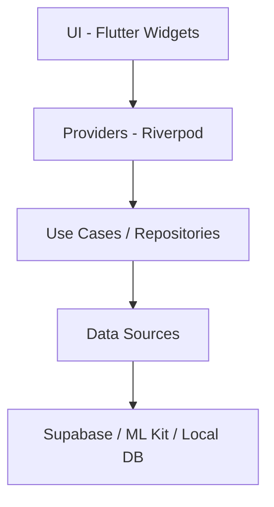

# PMDM — PagoLoMio

> PagoLoMio és una solució mòbil d'avantguarda que soluciona el problema de dividir els tiquets en restaurants. Desenvolupada amb Flutter, aprofita les capacitats del dispositiu per a oferir una experiència fluida mitjançant visió artificial local i sincronització en temps real.

## Arquitectura relacionada
El projecte segueix una arquitectura de **Clean Architecture** dividida en capes clarament diferenciades per a garantir la testabilitat i el manteniment a llarg termini:
- **Presentation**: Widgets de Flutter i gestió d'estat amb Riverpod.
- **Domain**: Entitats de negoci i definició de contractes (interfícies).
- **Data**: Implementacions dels repositoris, fonts de dades (Supabase, ML Kit) i models de transferència de dades (DTOs).



## Implementació tècnica destacada

### 1. Visió Artificial Local amb ML Kit
Per a minimitzar la latència i millorar la privacitat, PagoLoMio realitza el reconeixement de text (OCR) directament en el dispositiu. Utilitzem el paquet `google_mlkit_text_recognition` per a extraure les línies del tiquet abans d'enviar-les a refinament per IA.

```dart
// lib/data/datasources/ml_kit_datasource.dart
class MlKitDatasource {
  Future<RecognizedText> processImage(XFile imageFile) async {
    final recognizer = TextRecognizer(script: TextRecognitionScript.latin);
    try {
      final inputImage = InputImage.fromFilePath(imageFile.path);
      return await recognizer.processImage(inputImage);
    } finally {
      await recognizer.close();
    }
  }
}
```

### 2. Gestió d'Estat Reactiva amb Riverpod
L'aplicació utilitza **Riverpod 3** per a gestionar el flux de dades. Aquest enfocament ens permet desacoblar totalment la lògica de negoci dels widgets, facilitant la reactivitat quan un altre usuari del grup realitza un pagament o afegeix un producte.

```dart
// Exemple de definició d'un provider per a la càmera
final ocrProvider = StateNotifierProvider<OcrNotifier, OcrState>((ref) {
  return OcrNotifier(
    mlKit: ref.watch(mlKitDatasourceProvider),
    ai: ref.watch(aiServiceProvider),
  );
});
```

### 3. Navegació i Deep Linking
Mitjançant `GoRouter`, PagoLoMio implementa un sistema de rutes declaratiu que suporta *Deep Linking* (esquema `pagolomio://`). Això permet als usuaris unir-se a un grup de sopar simplement polsant un enllaç enviat per WhatsApp o Telegram.

```dart
// lib/core/services/deep_link_service.dart
void _handleUri(Uri uri, GoRouter router) async {
  if (uri.scheme == 'pagolomio' && uri.host == 'group') {
    final code = uri.queryParameters['code'];
    if (code != null) {
      await _ref.read(groupRepositoryProvider).joinGroup(inviteCode: code);
      router.go('/'); 
    }
  }
}
```

## Decisions de disseny i per què
- **OCR Local vs Cloud**: Es va decidir processar la imatge inicialment amb Google ML Kit en local per a oferir una resposta instantània a l'usuari ("Llegint tiquet..."). Només s'envia el text extret (no la imatge pesada) a un model de llenguatge en el núvol per a estructurar les dades, estalviant amplada de banda i costos.
- **GoRouter amb RefreshListenable**: S'utilitza un `authChangeNotifier` vinculat a Supabase perquè la interfície reaccione immediatament quan la sessió expira o l'usuari tanca la sessió, redirigint automàticament a la pantalla de Login sense lògica addicional en els widgets.

## Reptes resolts
Un dels reptes principals va ser l'**optimització de renders** en pantalles amb llistes llargues de productes i actualitzacions constants en temps real. Per a solucionar-ho, es van aplicar dues tècniques clau de Flutter:
1.  **RepaintBoundary**: Envoltant la llista de productes per a evitar que el refresc de tota la pantalla obligue a repintar cada ítem del tiquet si aquests no han canviat.
2.  **ValueKey**: Assignant claus úniques a cada fila d'ítem basada en el seu ID de model, cosa que ajuda al motor de Flutter a identificar quins elements s'han mogut o modificat realment en el *Widget Tree*.

```dart
// lib/presentation/screens/ticket/new_ticket_screen.dart
RepaintBoundary(
  child: ListView.builder(
    itemCount: _items.length,
    itemBuilder: (context, index) {
      final item = _items[index];
      return Padding(
        key: ValueKey(item), // Optimització de reconstrucció
        child: _OcrItemRow(...),
      );
    },
  ),
)
```
