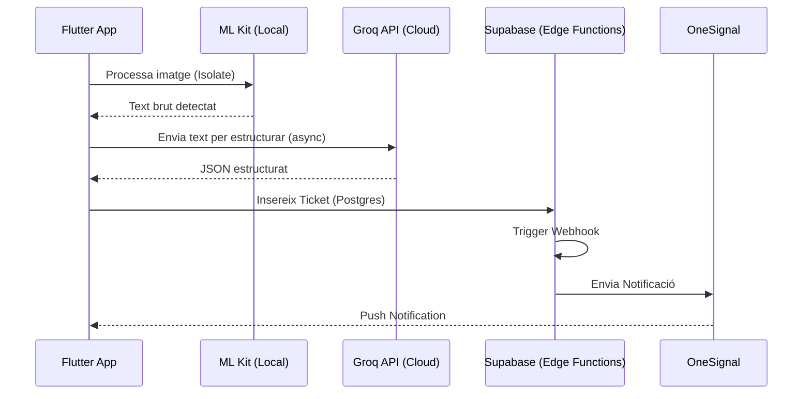

# PSP — PagoLoMio

> PagoLoMio és un exemple avançat de programació de serveis concurrents, on es coordinen processos de visió artificial en local, cridades asíncrones a models de llenguatge en el núvol (LLM) i notificacions push distribuïdes mitjançant arquitectures serverless.

## Arquitectura relacionada
El sistema es basa en un flux de treball asíncron que evita bloquejar el fil principal (*main thread*) de Flutter, garantint una experiència d'usuari fluida mentre es realitzen operacions pesades de xarxa o de processament d'imatge.



## Implementació tècnica destacada

### 1. Cridades Asíncrones i Gestió de Timeouts
Per a la comunicació amb l'API de Groq (IA), s'utilitzen patrons `async/await` amb un control estricte de **Timeouts**. Atès que el processament d'IA pot ser variable, limitem l'espera a 15 segons per a evitar que l'usuari es quede bloquejat indefinidament.

```dart
// lib/data/ai/groq_service.dart
final response = await http.post(
  url,
  headers: {
    'Authorization': 'Bearer $apiKey',
    'Content-Type': 'application/json',
  },
  body: jsonEncode({
    "model": "llama-3.1-8b-instant",
    "messages": [{"role": "system", "content": _systemPrompt}, ...],
    "response_format": {"type": "json_object"}
  }),
).timeout(const Duration(seconds: 15)); // Gestió de timeout
```

### 2. Edge Functions Serverless (TypeScript/Deno)
PagoLoMio delega la lògica d'enviament de notificacions a **Supabase Edge Functions**. Aquestes funcions s'executen en un entorn Deno aïllat cada vegada que s'insereix un ticket, actuant com un microservei desacoblat de l'aplicació mòbil.

```typescript
// supabase/functions/send-ticket-notification/index.ts
serve(async (req: Request) => {
  const body = await req.json();
  const record = body.record; // Dades del ticket insertat

  // Cridada a la REST API de OneSignal
  const oneSignalResponse = await fetch(ONESIGNAL_API_URL, {
    method: "POST",
    headers: {
      "Content-Type": "application/json",
      "Authorization": `Key ${ONESIGNAL_API_KEY}`,
    },
    body: JSON.stringify({
      app_id: ONESIGNAL_APP_ID,
      include_external_user_ids: recipientIds, // Enviament segmentat
      contents: { en: `Se ha creado: ${record.title}` },
    }),
  });
  return new Response(JSON.stringify({ ok: true }), { status: 200 });
});
```

### 3. Pipeline Híbrid OCR + IA
Una de les decisions tècniques més rellevants és el pipeline de dades. En lloc d'enviar la imatge completa (diversos MB) a un servei d'IA al núvol, la visió artificial es divideix:
1.  **Local (ML Kit)**: Extracció geomètrica del text (molt ràpid, cost zero).
2.  **Cloud (Groq/LLM)**: Lògica de comprensió de text per a convertir "Brav. 4.50" en un objecte `{"name": "Bravas", "price": 4.50}`.

## Decisions de disseny i per què
- **OneSignal sense Firebase**: S'ha optat per OneSignal per a simplificar la gestió de certificats en iOS i Android i evitar la dependència del SDK de Firebase, que augmenta considerablement el pes de l'aplicació (*binary size*). La vinculació es fa mitjançant l'**external_user_id**, fent coincidir l'ID de Supabase amb l'ID de OneSignal.
- **Isolates en Flutter**: Per al processament de la imatge de la càmera, s'ha considerat l'ús de `compute` o *Isolates* per a evitar que el "parsing" de milers de caràcters de text puga causar *jank* (petites pauses) en les animacions de la UI.

## Reptes resolts
El repte principal va ser la **concurrència en les notificacions**. Quan un usuari crea un tiquet, la Edge Function ha de recuperar els membres del grup i enviar la notificació a tots excepte al creador. Això es resol mitjançant una *query* a Supabase dins de la mateixa funció serverless, garantint que el creador no reba un avís d'una acció que ell mateix ha realitzat, millorant així l'experiència d'usuari.