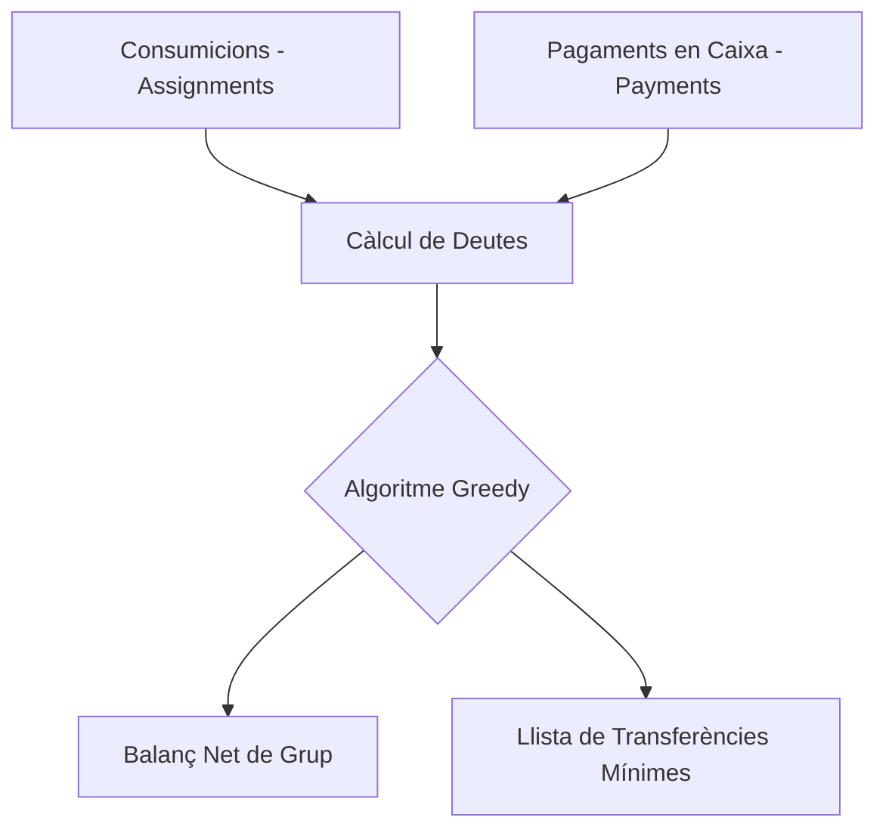

# Sistemes de Gestió Empresarial — PagoLoMio

> PagoLoMio actua com un micro-sistema de gestió empresarial (ERP) especialitzat en la liquidació de deutes. Mitjançant algoritmes d'optimització financera, el sistema consolida múltiples operacions de consum en un balanç net que minimitza el nombre de transaccions necessàries entre els usuaris.

## Arquitectura relacionada
El mòdul de gestió es basa en una arquitectura de serveis purs on la lògica de càlcul està separada de la persistència. Això permet realitzar auditories comptables en temps real sense dependre de la latència de la base de dades.



## Implementació tècnica destacada

### 1. Algoritme Greedy d'Optimització de Deutes
Per a evitar que un grup de 10 persones hagi de fer 45 transferències entre si, PagoLoMio implementa un algoritme **Greedy**. Aquest algoritme emparella el deutor més gran amb l'acreedor més gran recursivament, garantint que el nombre de transferències mai siga superior a **N-1** (on N és el nombre de participants).

```dart
// lib/domain/services/settlement_service.dart
static List<SettlementTransaction> calculateSettlement(Map<String, double> balances) {
  // Separem deutors i acreedors
  final debtors = balances.entries.where((e) => e.value < -0.01).toList();
  final creditors = balances.entries.where((e) => e.value > 0.01).toList();

  // Algoritme greedy: emparella deutor i acreedor màxims
  while (i < debtors.length && j < creditors.length) {
    final amount = min(debtors[i].value.abs(), creditors[j].value);
    result.add(SettlementTransaction(
      fromUserId: debtors[i].key,
      toUserId: creditors[j].key,
      amount: amount,
    ));
    // Actualitza saldos restants...
  }
}
```

### 2. Gestió de Modes de Pagament (Business Rules)
El sistema suporta tres regles de negoci per a la gestió de la caixa:
- **Full (Un paga tot)**: Un usuari posa el total en caixa i la resta li deu la seua part proporcional.
- **Split (Pagament dividit)**: Diversos usuaris posen quantitats arbitràries en caixa (per exemple, 20€, 15€ i 10€) i el sistema calcula qui ha pagat de més o de menys respecte al seu consum real.
- **Self (Cadascú el seu)**: No es generen deutes; se sobreentén que cadascú ha pagat exactament el que ha consumit directament al restaurant.

### 3. Consolidació i Traçabilitat
A diferència d'altres aplicacions que només gestionen un tiquet aïllat, PagoLoMio permet la **consolidació de deutes**. Mitjançant la funció `accumulateTicketData`, el sistema suma els consums i pagaments de tots els tiquets "settled" d'un grup per a oferir un balanç net històric. Això és equivalent a un llibre de comptabilitat on cada tiquet és un assentament.

## Decisions de disseny i per què
- **Balanç Net en lloc de Deute Brut**: En lloc de registrar "A deu 5€ a B" i "B deu 3€ a A", el sistema només emmagatzema que "A deu 2€ a B". Això simplifica l'auditoria i redueix el soroll visual per a l'usuari final.
- **Precisió Financera**: S'utilitzen arrodoniments controlats a dos decimals en cada pas del càlcul per a evitar els errors de coma flotant típics de JavaScript/Dart que podrien fer que un deute "no quadre" per 0.01€.

## Reptes resolts
El repte comptable més complex va ser la **gestió de propines i descomptes**. Aquests no s'assignen com a productes individuals, sinó que es prorrategen entre els consumidors del tiquet o s'integren en el preu final del producte durant el refinament amb IA. L'algoritme Greedy s'ha hagut de protegir contra residus infinits assegurant que la suma total de balances del grup sempre siga exactament **zero** abans de començar la liquidació.
