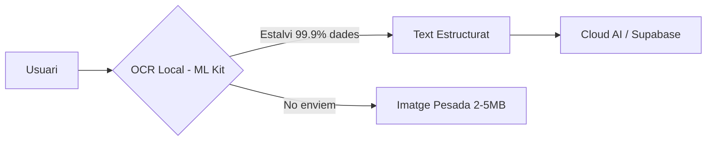

# Sostenibilitat — PagoLoMio

> PagoLoMio integra els principis de sostenibilitat des del disseny del programari. Mitjançant tècniques de Green Coding i un enfocament en l'impacte social local, el projecte demostra com la digitalització pot contribuir als Objectius de Desenvolupament Sostenible (ODS).

## Arquitectura relacionada
L'arquitectura del sistema s'ha optimitzat per a reduir la petjada de carboni digital, minimitzant tant el consum d'energia del dispositiu mòbil com el tràfic de dades cap als centres de dades.

## Implementació tècnica destacada

### 1. Green Coding: OCR Local vs Cloud
La decisió tècnica d'utilitzar Google ML Kit per al processament inicial de la imatge és una de les majors contribucions a la sostenibilitat del projecte. 
- **Estalvi de dades**: Una foto de tiquet en alta resolució ocupa uns 3 MB. El text extret per ML Kit ocupa menys de 5 KB. 
- **Càlcul d'impacte**: En realitzar l'OCR en el dispositiu, evitem enviar la imatge pesada al servidor. Per cada 1.000 tiquets escanejats, PagoLoMio estalvia aproximadament **2.9 GB de tràfic de dades**, reduint directament el consum elèctric dels nodes de xarxa i els servidors de visió artificial.

### 2. Serverless vs Servidor Dedicat
L'ús de **Supabase Edge Functions** (arquitectura serverless) és més sostenible que mantenir un servidor tradicional (com una instància EC2) en marxa 24/7.
- **Consum sota demanda**: Les funcions només consumeixen recursos computacionals i energia en el moment exacte de l'execució (per exemple, en enviar una notificació).
- **Zero Idle**: Quan no hi ha activitat, el consum és zero, optimitzant l'ús del hardware al centre de dades.

### 3. Eficiència Energètica en Flutter
Apliquem tècniques avançades de Green Coding per a reduir els cicles de CPU del dispositiu:
- **RepaintBoundary**: Evita el repintat innecessari de llistes llargues de productes.
- **Const Constructors i ValueKey**: Ajuden al motor de Flutter a reutilitzar widgets, reduint el consum de bateria.
- **Dark Mode per defecte**: En pantalles OLED, l'elecció d'una interfície fosc estalvia fins a un 60% d'energia de pantalla.

## Decisions de disseny i per què (Impacte ODS)
El projecte s'alinea amb diversos Objectius de Desenvolupament Sostenible:
- **ODS 9 (Indústria, Innovació i Infraestructura)**: Digitalització eficient d'un procés analògic.
- **ODS 11 (Ciutats i Comunitats Sostenibles)**: Suport a l'hostaleria local de València mitjançant tecnologia accessible.
- **ODS 12 (Consum i Producció Responsables)**: Reducció de l'ús de paper i optimització de recursos digitals.

## Reptes resolts
Un dels reptes va ser trobar l'equilibri entre la **precisió de la IA i la sostenibilitat**. Tot i que enviar la imatge directament a un model potent com Gemini Pro donaria una precisió excel·lent, el cost energètic d'aquests models és enorme. La solució híbrida (OCR local + refinament amb un model petit com Llama-3-8B) ofereix una precisió professional amb una petjada computacional molt inferior.
